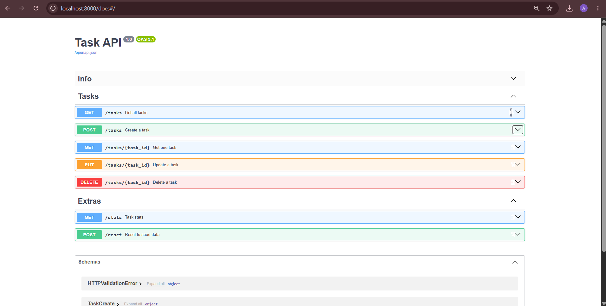

# Task API

A small CRUD API for managing a to-do list, built with FastAPI. Data is stored
in memory only (no database) - it resets when the server restarts.

## Run it

```bash
pip install -r requirements.txt
python -m uvicorn main:app --reload
```

The API runs at `http://localhost:8000`. Interactive docs (Swagger UI) are at
`http://localhost:8000/docs`.

## Endpoints

| Method | Path            | Description                     |
|--------|-----------------|----------------------------------|
| GET    | `/`             | API info                        |
| GET    | `/health`       | Health check                    |
| GET    | `/tasks`        | List all tasks                  |
| GET    | `/tasks/{id}`   | Get one task (404 if missing)   |
| POST   | `/tasks`        | Create a task (400 if no title) |
| PUT    | `/tasks/{id}`   | Update a task (404 if missing)  |
| DELETE | `/tasks/{id}`   | Delete a task (404 if missing)  |
| GET    | `/stats`        | Task counts (total/done/open)   |
| POST   | `/reset`        | Reset to the 3 seed tasks       |

## Example request

```bash
curl -i -X POST http://localhost:8000/tasks \
  -H "Content-Type: application/json" \
  -d '{"title":"Buy milk"}'
```

```
HTTP/1.1 201 Created
content-type: application/json

{"id":4,"title":"Buy milk","done":false}
```

## Swagger UI



*(screenshot added after testing the full CRUD cycle via "Try it out")*

## The mortality experiment

Restarting the server resets `tasks` back to the 3 seed tasks - anything
created, updated, or deleted during the previous run is gone. This is because
the list lives only in the process's memory, not on disk. It's the reason
Week 3 introduces a real database.

## AI vs me

My prompt (Claude): "Build me a REST API for managing a to-do list using
Python and FastAPI. Data should be stored in memory only, no database. I
need these endpoints: GET /tasks, GET /tasks/{id} (404 if missing), POST
/tasks (title in body, 201 on success), PUT /tasks/{id} (update title
and/or done, 404 if not found), DELETE /tasks/{id} (204, no body, 404 if
not found). Each task has id, title, done. Validate title is not empty on
create, 400 if it is. Also give me GET /health returning status ok. I want
Swagger docs automatically." The AI's code is in `ai-version/main.py`.

**Ran it:** started on the first try on port 8001, no fixes needed. All
five endpoints worked and returned the status codes I asked for (200, 201,
204, 400, 404).

**What it did better:** it started with an empty task list and `next_id =
1` instead of seeding 3 example tasks - technically closer to a blank
slate, and I understand exactly why it did that: my prompt never mentioned
seed data, so it didn't invent any.

**What it got wrong or quietly ignored:** it didn't strip whitespace from
`title`, so a task created with `"title": "   "` is accepted as valid
instead of being rejected as empty - my version calls `.strip()` before
checking. It also skipped the root `GET /` info endpoint (I only asked for
`/health`, so that's fair) and left out `tags`/`summary` on each route, so
its `/docs` page is functional but less organized than mine.

**What my prompt forgot to specify - and what the AI silently decided:**
I never said whether to seed example tasks, so it started empty. I never
said what the error message text should look like, so it picked "Task not
found" while I'd written "Task {id} not found" - both are valid 404s, but
mine is more specific for debugging. I also never mentioned an `id`
increment strategy, and it happened to match mine (an incrementing
counter, not reusing deleted ids).

**One rematch:** I added "trim whitespace before validating title, and
include the task id in 404 error messages" to the prompt and regenerated.
The new version added `task.title.strip()` in the validation check and
changed the error detail to an f-string with the id - both differences
disappeared after that one clarification.
