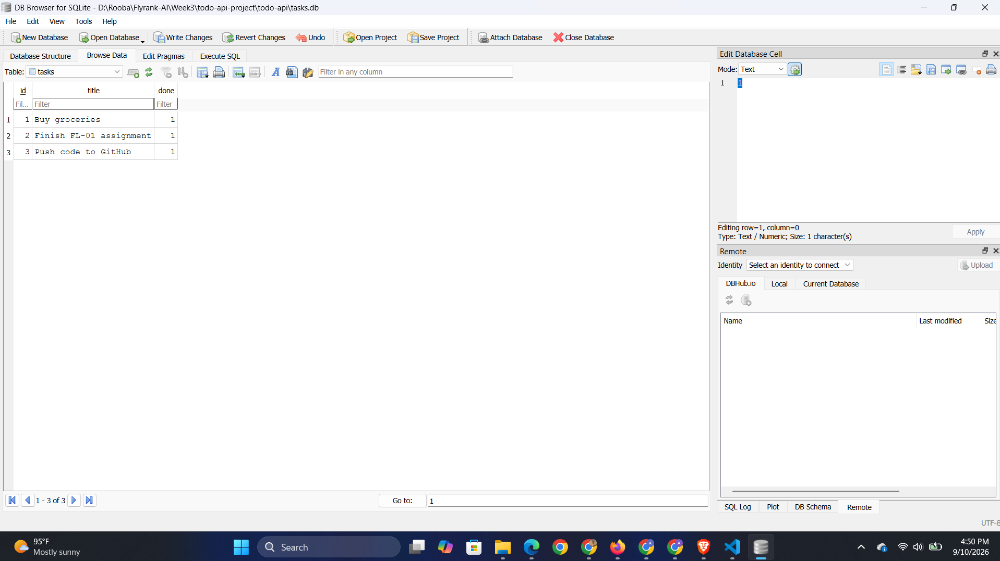

# Task API

A small CRUD API for managing a to-do list, built with FastAPI. Data is stored
in a SQLite database (`tasks.db`), so it survives server restarts.

## Run it

```bash
pip install -r requirements.txt
python -m uvicorn main:app --reload
```

The API runs at `http://localhost:8000`. Interactive docs (Swagger UI) are at
`http://localhost:8000/docs`. On first run, `tasks.db` and the `tasks` table
are created automatically, and 3 example tasks are seeded once.

## Endpoints

| Method | Path            | Description                     |
|--------|-----------------|----------------------------------|
| GET    | `/`             | API info                        |
| GET    | `/health`       | Health check                    |
| GET    | `/tasks`        | List all tasks                  |
| GET    | `/tasks/{id}`   | Get one task (404 if missing)   |
| POST   | `/tasks`        | Create a task (400 if no title) |
| PUT    | `/tasks/{id}`   | Update a task (404 if missing)  |
| DELETE | `/tasks/{id}`   | Delete a task (404 if missing)  |
| GET    | `/stats`        | Task counts (total/done/open)   |

## Example request

```bash
curl -i -X POST http://localhost:8000/tasks \
  -H "Content-Type: application/json" \
  -d '{"title":"Buy milk"}'
```

```
HTTP/1.1 201 Created
content-type: application/json

{"id":4,"title":"Buy milk","done":false}
```

## Database

**Why SQLite:** no separate server to install or run, the whole database is
one file, and it's more than enough for a project this size. Moving to
Postgres or MySQL later only means changing the connection code in `db.py`,
not the API routes.

**Where it lives:** `tasks.db`, created automatically on first run in the
project's root folder. It's git-ignored, so every fresh clone starts with a
clean database and the 3 seed tasks.

**Schema:** one table, `tasks(id INTEGER PRIMARY KEY, title TEXT, done
INTEGER)`.

**One query I ran by hand in DB Browser:**
```sql
UPDATE tasks SET done = 1;
```
This marked every existing task as done directly in the database, with the
server still running. Calling `GET /tasks` right after showed the change
immediately, no restart needed, because the API and DB Browser read the exact
same `tasks.db` file.



## Swagger UI


## The mortality experiment (from A1) - now fixed

In Assignment 1, restarting the server reset all tasks, because they lived
only in memory. Now, tasks are stored in `tasks.db` on disk, so restarting
the server (or my computer) no longer erases anything. The only thing that
resets state is manually deleting `tasks.db`.

## AI vs me

My prompt (Claude): "Migrate my in-memory CRUD task API (FastAPI) to use
SQLite instead. Create tasks.db, a tasks table with id, title, done columns,
create the table if it's missing, seed 3 example tasks only if the table is
empty. Keep all 5 endpoints (GET /tasks, GET /tasks/{id}, POST /tasks, PUT
/tasks/{id}, DELETE /tasks/{id}) with identical behavior: 400 on empty
title, 404 on unknown id, 201 on create, 204 on delete. Use parameterized
queries." The AI's code is in `ai-version-db/`.

**Ran it:** started on the first try, created `tasks.db` automatically,
seeded 3 tasks once, and full CRUD worked including persistence across a
restart.

**What it did better - and I understand why:** it used a single shared
database connection opened once at startup (`check_same_thread=False`)
instead of opening and closing a new connection on every request like my
version does. For a small app this is a legitimate simplification and
avoids the overhead of reconnecting every time, though it becomes a real
concurrency risk under heavier simultaneous load.

**What it got wrong or quietly ignored:** even though I explicitly asked for
parameterized queries everywhere, the `GET /tasks/{id}` endpoint uses plain
string concatenation (`"WHERE id = " + str(task_id)`) instead of a `?`
placeholder. It's not exploitable here only because FastAPI's path
validation already forces `task_id` to be an integer before it reaches the
query, but it's exactly the pattern that becomes a SQL injection risk the
moment a similar field accepts a string. It also silently dropped `NOT
NULL` on the `title` column and shortened every error message to a generic
"Task not found" instead of naming the id.

**What my prompt forgot to specify - and what the AI silently decided:** I
never said how to manage the connection lifecycle, so it picked one global
connection instead of per-request connections. I never specified the exact
error message text, so it picked its own generic wording instead of
matching my A1 style.

**One rematch:** I added "use a `?` placeholder for every query, including
lookups by id, with no string concatenation anywhere" to the prompt and
regenerated. The new version fixed the `GET /tasks/{id}` query to use a
parameterized placeholder, closing that gap.
