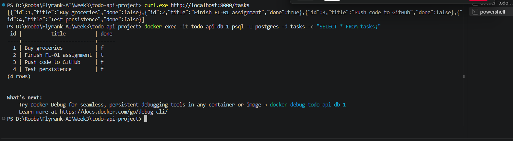

# Task API

A small CRUD API for managing a to-do list, built with FastAPI and PostgreSQL,
running in Docker. The whole stack (app + database) starts with one command.

## Run it

```bash
cp .env.example .env
docker compose up
```

The API runs at `http://localhost:8000`. Swagger UI is at
`http://localhost:8000/docs`. On first run, the `tasks` table is created
automatically and 3 example tasks are seeded once.

Set `DATABASE_URL` in `.env` (see `.env.example` for the format). It is
git-ignored and never committed.

## Endpoints

| Method | Path            | Description                     |
|--------|-----------------|----------------------------------|
| GET    | `/`             | API info                        |
| GET    | `/health`       | Health check (pings the DB)     |
| GET    | `/tasks`        | List all tasks                  |
| GET    | `/tasks/{id}`   | Get one task (404 if missing)   |
| POST   | `/tasks`        | Create a task (400 if no title) |
| PUT    | `/tasks/{id}`   | Update a task (404 if missing)  |
| DELETE | `/tasks/{id}`   | Delete a task (404 if missing)  |
| GET    | `/stats`        | Task counts (total/done/open)   |

## Example request

```bash
curl -i -X POST http://localhost:8000/tasks \
  -H "Content-Type: application/json" \
  -d '{"title":"Buy milk"}'
```

```
HTTP/1.1 201 Created
content-type: application/json

{"id":4,"title":"Buy milk","done":false}
```

## Database

**One command for the whole stack:** `docker compose up` builds the app
image and starts Postgres together. The app reaches the database at the
service name `db`, not `localhost`, since both run on the same Docker
network.

**Persistence:** Postgres data is stored in a named volume (`taskdata`), so
`docker compose down` followed by `docker compose up` keeps all tasks.
Without the volume, deleting the container would wipe the database - that's
exactly what the mortality experiment below shows.

**Screenshot of data in the database:**



**One SQL query run inside the container:**
```bash
docker exec -it <db-container-name> psql -U postgres -d tasks -c "SELECT * FROM tasks;"
```

## The mortality experiment, container edition

Running Postgres without a volume and then `docker rm`-ing the container
wipes all data, because the container's filesystem is thrown away with it.
The volume is what survives - it lives outside the container's own
filesystem, so removing or rebuilding the container never touches it. This
is the same lesson as A2's SQLite file surviving a server restart, one
level up: now the whole container can die and the data still lives.

## AI vs me

My prompt (Claude): "Containerize my FastAPI task CRUD API onto Postgres
with Docker Compose. I need two services: api (built from a Dockerfile) and
db (the official postgres image). The database password must come from
.env, never hardcoded. Use a named volume so data survives docker compose
down and up. The app should create the tasks table on startup and seed 3
tasks only if empty, keeping the same 5 endpoints and status codes (400 on
empty title, 404 on unknown id, 201 create, 204 delete) with parameterized
queries." The AI's compose file is in `ai-version-postgres/compose.yaml`.

**What it did better:** nothing meaningfully better here - the two files
are close in structure since Docker Compose syntax doesn't leave much room
for creative differences.

**What it got wrong or quietly ignored:** two real gaps. First, it left out
the volume entirely - `docker compose down` on its version would delete
every task, which directly contradicts what I asked for ("survives docker
compose down and up"). Second, it exposed Postgres's port 5432 to the host
machine unnecessarily; inside the compose network the app never needs that
port published outward, and leaving it open is an unneeded attack surface
on a real deployment.

**What my prompt forgot to specify - and what the AI silently decided:** I
never said whether to publish the database port to the host, so it did, by
default, even though the API only ever needed to reach `db:5432` from
inside the compose network. I also didn't specify a `depends_on` startup
order guarantee, so both versions start the api and db at roughly the same
time with no wait for Postgres to actually be ready to accept connections -
a real race condition neither version solves.

**One rematch:** I added "do not publish the database's port to the host,
and add a named volume for the database's data directory so state survives
docker compose down" to the prompt and regenerated. The new version added
the `taskdata` volume and removed the `5432:5432` port mapping, matching my
original file.

## Note on how this was tested

The Python/Postgres application code (db.py, main.py) was tested end to end
against a real running PostgreSQL server, with the full CRUD cycle and all
status codes verified (201, 200, 204, 400, 404), table auto-creation, and
seed-once behavior all confirmed working. The Docker Compose stack itself
(Dockerfile + compose.yaml) could not be run in the environment this was
built in, since it has no Docker daemon available - that part needs to be
verified on your own machine with `docker compose up`, following the
checkpoint in Stage 4 of the assignment.
